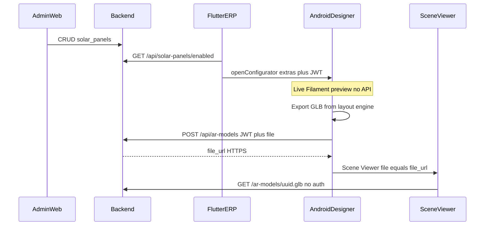

# Solar AR — Flutter implementation spec

Integrate **Solar AR** into Solar ERP (`solar360_app`, applicationId `com.imt.greenenergy`) so a signed-in sales user can pick a panel from the company catalog, design a rooftop in a live in-app preview, then open that layout in **Google Scene Viewer**.

Backend APIs already exist. This spec covers the Flutter + Android work: Dart screens, JWT catalog call, MethodChannel, native designer, on-device GLB export, upload, and Scene Viewer intent.

**API base (UAT):** `https://uat-imt-billbook.immortalgroup.in/api`  
See `lib/core/network/api_constants.dart`. Dio already attaches `Authorization: Bearer <JWT>` via `ApiService`.

---

## 1. Goal

| Actor | What they do |
| --- | --- |
| Admin (web, not this app) | Maintains panel catalog (brand, size, watt range, enabled). |
| Sales (this app) | Opens Solar AR, picks an enabled panel, designs the array, taps **View in Google AR**. |

The phone must export a `.glb` of the **current** slider state, `POST` it to the VPS, then open Scene Viewer with the returned public HTTPS `file_url`. Google’s servers fetch that URL — localhost / LAN IP will fail.

---

## 2. v1 constraints

Implement:

- Android only for designer + Scene Viewer
- Live 3D preview inside the ERP APK (Filament / SceneView, **not** ARCore camera)
- Catalog from `GET /api/solar-panels/enabled` (tenant-scoped by JWT)
- One GLB upload per **View in Google AR** tap
- iOS / non-Android: catalog screen can load; tapping a panel shows a snackbar that designer and Scene Viewer are Android-only

Do **not** implement:

- In-app ARCore placement
- iOS AR
- Saving a design to a lead / quote
- Dart-side GLB upload (`POST /ar-models` belongs in Kotlin)
- Shipping the standalone `ar_test` POC as a product — port the designer into this app

---

## 3. Architecture



Rules:

- While sliders move, **do not** hit the network. Recompute layout on device.
- Preview and exported GLB must use the **same** layout numbers (`SolarArrayLayoutEngine`).
- Scene Viewer `file` query param must be the public `file_url`, not an `/api/...` path and not a `file://` URI.

---

## 4. Build order

Follow this sequence. Match existing ERP patterns (`ApiService`, Riverpod, `AppDestination`, MethodChannel in `MainActivity`).

### 4.1 Endpoint constants

In `lib/core/network/api_endpoints.dart` add:

```dart
static const solarPanels = 'solar-panels';
static const solarPanelsEnabled = 'solar-panels/enabled';
static String solarPanel(String id) => 'solar-panels/$id';
static const arModels = 'ar-models';
```

Flutter only needs `solarPanelsEnabled` for the list. `arModels` is used from Android as `{ApiConstants.baseUrl}/ar-models`.

### 4.2 Feature folder (create)

```
lib/features/ar_solar/
  data/models/solar_panel_model.dart
  data/solar_panel_api_service.dart
  data/ar_solar_native_service.dart
  presentation/providers/ar_solar_providers.dart
  presentation/screens/solar_ar_panels_screen.dart
```

### 4.3 Panel model

Map API snake_case:

| JSON | Dart |
| --- | --- |
| `id` | `String id` |
| `company_name` | `String companyName` |
| `width_m` / `length_m` | `double widthM` / `lengthM` |
| `min_watts` / `max_watts` / `default_watts` | `int` |
| `watt_step` | `int`, default `10` |
| `enabled` | `bool`, default `true` |

Helpers: size label `1.22 × 2.29 m`, watts label `500–630 W`. Use existing `formatters.dart` (`asString`, `asDouble`, `asInt`, `asBool`).

### 4.4 Catalog API service

`SolarPanelApiService` takes `ApiService`. Call `GET` `ApiEndpoints.solarPanelsEnabled`.

Response is a **JSON array** (not `{ data: [...] }`). Still accept a map with `data` for safety:

```dart
final res = await _api.get(ApiEndpoints.solarPanelsEnabled);
final list = res is List ? res : (res is Map ? (res['data'] as List? ?? []) : []);
```

### 4.5 Providers

Use `lib/core/providers/network_providers.dart` (`apiServiceProvider`, `tokenStorageProvider`).

- `solarPanelApiServiceProvider`
- `arSolarNativeServiceProvider`
- `enabledSolarPanelsProvider` — `FutureProvider.autoDispose` calling `listEnabled()`

### 4.6 Panel list screen

`SolarArPanelsScreen`:

- App bar title **Solar AR**
- `RefreshIndicator` + card list (company name, size, watt range, AR icon)
- Loading / error / empty states (`LoadingState`, `ErrorState`, `EmptyState`)
- Empty copy: *Ask an admin to add panel sizes in Green Energy → AR Panels.*
- On tap:
  1. If not Android → snackbar: rooftop designer and Google Scene Viewer are Android-only; Google app required.
  2. `tokenStorageProvider.getActiveToken()`. If missing → ask user to sign in again.
  3. `ArSolarNativeService.openConfigurator(panel, authToken, apiBaseUrl: ApiConstants.baseUrl)`.
  4. Catch `PlatformException` and show `error.message`.

### 4.7 Route

In `lib/app/app_routes.dart`:

```dart
'/solar/ar': (_) => const SolarArPanelsScreen(),
```

### 4.8 Drawer

In `lib/features/shell/presentation/nav_destinations.dart`, add an `AppDestination` next to other Green Energy CRM items:

| Field | Value |
| --- | --- |
| `id` | `ge_solar_ar` |
| `label` | Solar AR |
| `icon` / `selectedIcon` | `Icons.view_in_ar_outlined` / `Icons.view_in_ar_rounded` |
| `section` | `NavSection.solarCrm` |
| `kind` | `NavKind.route` |
| `permission` | `solar_panel.read` |
| `route` | `/solar/ar` |
| `quickAction` | `true` |
| `quickActionSubtitle` | Design rooftop in AR |

Do not add a shell tab. Permission gating is already handled by `AppDestination.permission`.

### 4.9 Dart MethodChannel

`ArSolarNativeService`:

- Channel name: `com.imt.greenenergy/ar_solar`
- Method: `openConfigurator`
- On non-Android throw `PlatformException(code: 'unsupported_platform', ...)`

Invoke map:

```dart
{
  'id': panel.id,
  'companyName': panel.companyName,
  'widthM': panel.widthM,
  'lengthM': panel.lengthM,
  'minWatts': panel.minWatts,
  'maxWatts': panel.maxWatts,
  'defaultWatts': panel.defaultWatts,
  'wattStep': panel.wattStep,
  'authToken': authToken,
  'apiBaseUrl': apiBaseUrl,
}
```

Mirror the existing downloads channel pattern in `MainActivity.kt` (`com.imt.greenenergy/downloads`): register a second `MethodChannel` in `configureFlutterEngine`.

On `openConfigurator`, start `SolarConfigActivity` with extras (see §6). `result.success(null)` after `startActivity`. On failure `result.error("AR_OPEN_FAILED", message, null)`.

---

## 5. API contracts

All `/api/...` routes need `Authorization: Bearer <JWT>` unless noted.

### 5.1 `GET /api/solar-panels/enabled` — Flutter catalog

| | |
| --- | --- |
| Permission | `solar_panel.read` |
| Tenant | JWT company only |
| Response | JSON array of enabled, active panels |

```json
{
  "id": "uuid",
  "company_id": "uuid",
  "company_name": "UTL",
  "width_m": 1.2192,
  "length_m": 2.286,
  "min_watts": 500,
  "max_watts": 630,
  "default_watts": 500,
  "watt_step": 10,
  "enabled": true,
  "is_active": true,
  "created_at": "...",
  "updated_at": "..."
}
```

### 5.2 `POST /api/ar-models` — Android uploader

| | |
| --- | --- |
| Permission | `solar_panel.read` |
| Content-Type | `multipart/form-data` |
| Field | `file` — `.glb` only, max **20 MB** |
| URL | `{ApiConstants.baseUrl}/ar-models` e.g. `https://uat-imt-billbook.immortalgroup.in/api/ar-models` |
| Success | `201` |

```json
{
  "id": "uuid-without-extension",
  "file_url": "https://uat-imt-billbook.immortalgroup.in/ar-models/{uuid}.glb",
  "content_type": "model/gltf-binary",
  "bytes": 123456
}
```

Use `file_url` as Scene Viewer’s `file` param. If upload fails, stay on the designer and show the error (`message` / `error` from JSON, or HTTP code).

Implement upload in Kotlin (`HttpURLConnection` is enough). Do **not** upload from Dart.

### 5.3 `GET /ar-models/{uuid}.glb` — Google only

| | |
| --- | --- |
| Auth | **None** — public HTTPS |
| Path | **Outside** `/api` |
| Content-Type | `model/gltf-binary` |

The Flutter HTTP client must not call this. Scene Viewer fetches it from Google’s network.

### 5.4 Admin APIs (do not call from the app)

Catalog is maintained in admin web **Green Energy → AR Panels** (`/solar/ar-panels`):

| Method | Route | Permission |
| --- | --- | --- |
| `GET` | `/api/solar-panels` | `solar_panel.read` |
| `GET` | `/api/solar-panels/:id` | `solar_panel.read` |
| `POST` | `/api/solar-panels` | `solar_panel.create` |
| `PUT` | `/api/solar-panels/:id` | `solar_panel.update` |
| `POST` | `/api/solar-panels/:id/deactivate` | `solar_panel.update` |

---

## 6. Android native designer

Package: `com.imt.greenenergy.ar`.

### 6.1 Gradle

In `android/app/build.gradle.kts`:

- `minSdk = maxOf(flutter.minSdkVersion, 24)` (SceneView)
- Enable Compose (`buildFeatures { compose = true }`, Kotlin Compose plugin)
- Dependencies: Compose BOM + Material3, `androidx.activity:activity-compose`, `io.github.sceneview:arsceneview:4.26.0`

Also enable the Compose plugin in `android/settings.gradle.kts` if it is not already applied.

### 6.2 Files to add

| File | Role |
| --- | --- |
| `SolarConfigActivity.kt` | Designer UI (Compose) |
| `SolarArraySpec.kt` | Product, height limits, layout engine |
| `AssembledArray.kt` | SceneView nodes (panels + overlays) |
| `SolarInsights.kt` | kW / count labels |
| `SolarArrayGlbExporter.kt` | Build `.glb` bytes from current spec |
| `ArModelUploader.kt` | `POST` multipart to `/ar-models` |
| `assets/models/solar_panel.glb` | Authored panel mesh (`android/app/src/main/assets/models/solar_panel.glb`) |
| `Theme.ArSolar` | Activity theme |

Do **not** add in-app ARCore (`ArSolarActivity`, camera placement, AR availability checks).

### 6.3 Intent extras

Define keys (e.g. `SolarPanelExtras`) and map channel args:

| Extra | Type | Fallback |
| --- | --- | --- |
| id | String | `"panel"` |
| companyName | String | `"Solar panel"` |
| widthM / lengthM | Double | `1.2192` / `2.286` |
| minWatts / maxWatts / defaultWatts | Int | `500` / `630` / `500` |
| wattStep | Int | `10` |
| authToken | String | empty |
| apiBaseUrl | String | empty |

Scale the panel mesh if catalog `widthM`/`lengthM` differ from the authored GLB size.

### 6.4 Designer UX

Cinematic preview-first: **full-bleed SceneView** behind a floating glass HUD. Compact header (close, title, watt chip) and KPI pills overlay the top; a 2-line spec readout sits above a frosted control sheet (~38% height, scrollable) with a sticky **View in Google AR** CTA.

| Control | Spec |
| --- | --- |
| System size | Integer kW **2–5**, default 3 |
| Rows | **1 or 2**, default 2 |
| North / south post height | Clamp ~1–13 ft (store metres). Slope vs array length must stay valid (`sin < 0.98`) |
| Panel watts | Slider min–max, step from catalog |
| Overlays | Dimension / N-S chips on the sheet header (not a separate Display card) |
| Primary button | **View in Google AR**; while working show **Preparing AR…** and disable the button |

Close icon finishes the Activity (back to Flutter list). Camera orbit framing reserves ~12% top and ~36% bottom chrome so the array stays in the visible window.

Live preview: Filament engine + `modelLoader` from `models/solar_panel.glb`. Recompute `SolarArrayLayoutEngine` whenever spec changes. **No API** during slider moves.

### 6.5 View in Google AR

On button tap, on a background dispatcher:

1. `SolarArrayGlbExporter.export(spec)` → `ByteArray`
2. `ArModelUploader.upload(apiBaseUrl, token, bytes, "rooftop-array.glb")` → `file_url`
3. Open Scene Viewer:

```
https://arvr.google.com/scene-viewer/1.0
  ?file=<file_url>
  &mode=ar_preferred
  &resizable=false
  &title=<companyName wattW · totalKw rooftop>
```

`Intent.ACTION_VIEW` with `setPackage("com.google.android.googlequicksearchbox")`.

If Google app is missing: `ActivityNotFoundException` → stay on preview, message to install/update the Google app.

If export/upload fails: stay on preview, show `e.message`. Do not close the Activity.

Uploader details:

- Timeout: connect 30s, read 60s
- Header `Authorization: Bearer <token>`
- Multipart field name `file`, content type `model/gltf-binary`
- Parse `file_url` from JSON; throw if blank

### 6.6 Manifest

- Register `SolarConfigActivity`: `exported=false`, portrait, `hardwareAccelerated=true`, `Theme.ArSolar`
- `<queries>`: `<package android:name="com.google.android.googlequicksearchbox" />`
- Do **not** add CAMERA for this feature (no in-app ARCore)

---

## 7. Permissions

| Permission | App |
| --- | --- |
| `solar_panel.read` | Show drawer item, load catalog, upload GLB |
| `solar_panel.create` / `solar_panel.update` | Admin web only — ignore in Flutter |

JWT is issued at login. After backend seeds `solar_panel.read` onto SolarSales / Sales Manager / CompanyAdmin / SuperAdmin, the tester must **sign out and sign in** or the drawer item will not appear.

---

## 8. UAT / Scene Viewer

In-app preview can work without a public URL. **View in Google AR cannot.**

- Server `PUBLIC_BASE_URL` must be public HTTPS, e.g. `https://uat-imt-billbook.immortalgroup.in` (no trailing slash, no `/api`).
- Nginx must expose `/ar-models/` **without login**; `client_max_body_size` ≥ 25m.
- Smoke: `curl -I` a returned `file_url` → 200, `Content-Type: model/gltf-binary`, no login redirect.
- Device: Android, Google app installed, user with `solar_panel.read`, fresh login.
- Do not point `ApiConstants` / `PUBLIC_BASE_URL` at a Wi-Fi IP or `localhost` for Scene Viewer tests.

---

## 9. Acceptance criteria

- User with `solar_panel.read` sees **Solar AR** in Green Energy / Solar CRM (drawer + quick action). User without the perm does not.
- `/solar/ar` loads enabled panels from UAT API; pull-to-refresh works.
- Empty catalog shows the admin AR Panels empty state.
- Android tap opens native designer with that panel’s size and watt range (not a hardcoded SKU).
- Changing kW / rows / heights / watts updates the 3D preview immediately with no loading spinner / no HTTP.
- **View in Google AR** uploads a GLB and opens Scene Viewer with a `https://.../ar-models/{uuid}.glb` URL.
- Upload or missing Google app: error on the designer; preview still visible.
- iOS (or non-Android): snackbar only; no crash.
- No camera permission prompt for this flow.

---

## 10. Out of scope

- iOS designer / Scene Viewer
- ARCore camera rooftop placement
- Calling `POST /ar-models` from Dart
- Persisting a design on a lead or site survey
- Admin CRUD UI inside Flutter
- Productizing `ar_test`

---

## Appendix — call ownership

| Step | Implement in | Endpoint |
| --- | --- | --- |
| Show Solar AR list | Dart | `GET /api/solar-panels/enabled` |
| Open designer | Dart MethodChannel → Kotlin | none |
| Live preview | Kotlin Filament / SceneView | none |
| Export + upload GLB | Kotlin | `POST /api/ar-models` |
| Place in the real world | Google Scene Viewer | `GET /ar-models/{uuid}.glb` |
| Maintain catalog | Admin web (not this app) | `/api/solar-panels` CRUD |
